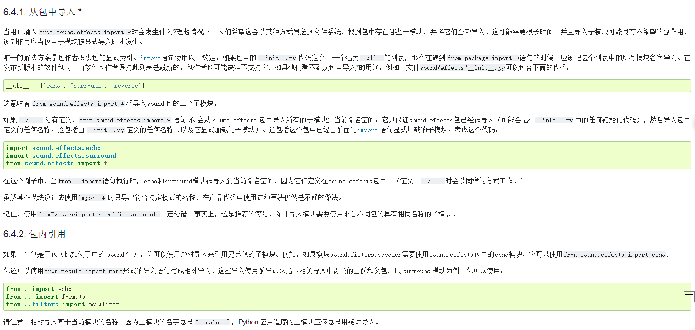

## python \_\_init__.py的使用

原创在这里：http://www.cnblogs.com/no13bus/archive/2013/03/14/2958618.html

### 1. 如何使一个目录变成包,如何import

    在目录下, 放一个__init__.py文件, 这该目录会被认为包. \_\_init__.py文件, 可以为空. 当一个包被import的时候, 会首先加载它的__init__.py文件, 一般可以在__init__.py文件中进行初始化. 需要用到包中模块,import的时候使用"."分割. 
    比如: 

  
        Sound/               包 
        |-- Effects          Sound的一个子包 
        |   |-- __init__.py 
        |   |-- errors.py 
        |   `-- iobuffer.py 
        |-- Filters          Sound的一个子包 
        |   |-- __init__.py 
        |   |-- dolby.py 
        |   |-- equalizer.py 
        |   |-- karaoke.py 
        |   `-- vocoder.py 
        |-- Utils            Sound的一个子包 
        |   |-- __init__.py 
        |   |-- echo.py 
        |   |-- reverse.py 
        |   `-- surround.py 
        `-- __init__.py      文件夹下放一个__init__.py文件, 则此文件夹为包
 
需要用到Sound/Utils/echo.py, 则:

        import Sound.Utils.echo
 
 
### 2. \_\_init__.py的__all__变量 
       
\_\_all__: \_\_init__.py的常用变量__all__指定的是指此包被import * 的时候, 哪些模块会被import进来. 

举例: Sound/\_\_init__.py是一个空文件, 则:
        
    >>> from Sound import * 
    >>> dir()  
        
    ['__builtins__', '__doc__', '__name__'] 
 
在Sound/__init__.py中, 写一行:

        __all__ = ['Effects', 'Filters', 'Utils']
    
则:

    >>> from Sound import *  
    >>> dir()  
    ['Effects', 'Filters', 'Utils', '__builtins__', '__doc__', '__name__'] 

 
### 3. \_\_init__.py的__path__变量

\_\_path__: \_\_init__.py的常用变量__path__, 默认情况下只有一个元素, 就是当前包的路径, 修改__path__, 可以修改此包内的搜索路径. 
    
举例: 

在Utils下增加2个目录Linux和Windows, 并各有一个echo.py文件, 目录如下 

    Sound/Utils/  
    |-- Linux        目录下没有__init__.py文件, 不是包, 只是一个普通目录  
    |   `-- echo.py  
    |-- Windows      目录下没有__init__.py文件, 不是包, 只是一个普通目录  
    |   `-- echo.py  
    |-- __init__.py  
    |-- echo.py  
    |-- reverse.py  
    `-- surround.py  
       三个echo.py的文件内容如下: 

    ltt@hz171-14:~/tmp$ cat Sound/Utils/echo.py  
    print "I'm Sound.Utils.echo"  
    ltt@hz171-14:~/tmp$ cat Sound/Utils/Windows/echo.py    
    print "I'm Windows.echo"  
    ltt@hz171-14:~/tmp$ cat Sound/Utils/Linux/echo.py        
    print "I'm Linux.echo"     

Sound/Utils/__init__.py是空文件,则结果如下:  
    
    >>> import Sound.Utils.echo  
    I'm Sound.Utils.echo     
        
把Sound/Utils/__init__.py改成:

    import sys 
    import os 

    print "Sound.Utils.__init__.__path__ before change:", __path__ 

    dirname = __path__[0] 
    if sys.platform[0:5] == 'linux': 
        __path__.insert( 0, os.path.join(dirname, 'Linux') ) 
    else: 
        __path__.insert( 0, os.path.join(dirname, 'Windows') ) 
    print "Sound.Utils.__init__.__path__ AFTER change:", __path__
 
则结果如下: 

    >>> import Sound.Utils.echo 
    Sound.Utils.__init__.__path__ before change: ['Sound/Utils']   
    Sound.Utils.__init__.__path__ AFTER change: ['Sound/Utils/Linux', 'Sound/Utils']   
    I'm Linux.echo  
    

这里优先linux路径下的echo，和\_\_path__里的顺序有关，insert（0，...）插入的时候，把linux出入到了一开始dirname前面，所以linux的echo先一步输出，若插入到后面则输出的是外面的echo

